# Overview

我想做 **Diffusion from Scratch: From DiT to Image Editing**，最直接的原因是这个方向学起来确实不容易。Diffusion 涉及概率过程、训练目标、采样方法和大量实现细节，DiT 又把 Transformer、条件控制与生成模型组合到了一起。很多概念单独看似乎能理解，但放进完整模型后，各个模块为什么存在、数据如何流动、公式怎样落到代码上，很容易重新变得模糊。

另一个问题是，现成库通常封装得很深。调用几行接口就能加载模型、跑出结果当然很方便，但真正想理解内部机制时，多层抽象反而会遮住最关键的逻辑。我过去也没有从数据准备、模型实现和训练开始，一直走到采样、图像编辑、性能分析与部署的完整流程。只跑通几次 inference，或者修改几个参数看效果，并不能让我真正建立起对整个系统的认识。

所以我想从底层重新走一遍这条路，尽量亲手实现必要的组件，并把每一步为什么这样设计讲清楚。我会借助费曼学习法，在尝试教别人、写出可读解释的同时暴露自己理解中的空白，再回到公式、论文和代码里把这些空白补上。这个项目既是一套学习记录，也是我整理知识结构和验证理解是否可靠的方法。

## Roadmap

我会按照“原理理解—模型实现—训练与采样—条件生成—图像编辑—工程部署”的顺序推进。前一阶段写出的模型、接口和实验结论会直接成为后一阶段的基础，尽量避免把内容做成互不相关的代码片段。

```mermaid
flowchart LR
    A[Prerequisites] --> B[Diffusion Fundamentals]
    B --> C[DiT Backbone]
    C --> D[Training]
    D --> E[Sampling]
    E --> F[Conditioning]
    F --> G[Image-to-Image]
    G --> H[Image Editing]
    H --> I[Editing Pipeline]
    I --> J[Editing Training]
    J --> K[Efficient Deployment]
```

## What I Want to Build

我不想让最终结果停留在“模型能够运行”或者“成功生成了一张图”。我希望做出一套结构干净、能够训练、方便调试和扩展的 generation 与 image editing pipeline，并让它真正能够承担一些有用的图像编辑任务。在此基础上，我还会继续做 profiling、quantization、memory optimization 和 deployment，弄清楚时间与显存究竟消耗在哪里，并验证不同优化手段对速度、资源占用和结果质量的实际影响。对我来说，这个项目真正完成的标志不是跑通一个 demo，而是把研究理解、完整流程和可用实现连接起来。
