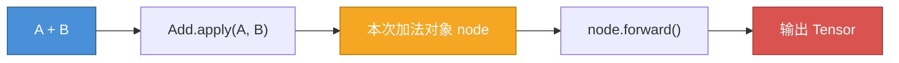

# 01 - 张量 网络的基本单元

数组是**数据结构课程**中最为核心的概念，它可以作为后续各类复杂数据类型的构建基石，对链表、树、堆、图等的概念理解都离不开对数组的认识。

同理，作为**机器学习领域**中最为核心的概念，Tensor 也值得你由浅入深地细致研究。在这一节中，我们会从概念分析开始，逐步亲手实现一个类似 `torch.Tensor` 的 `class Tensor`，也将是我们后续内容构建自己版本 `Module/Layer/Model` 时使用的依赖。

在本节的学习中，请带着如下问题：

1. Tensor 需要是什么样的？
2. Tensor 需要能做什么？
3. 为什么要考虑**优化**？

## Make a Tensor

在 Project page 中已经提到，Tensor 是神经网络中流动的基本单元，也是计算的基本单元，因此它必须有能够参与运算的数学性质，即**代数性（Arithmetic）**；同时，Tensor 可以被认为是矩阵概念的延伸，自然在高维场景下继承了矩阵所具有的**基本属性（Properties）** 和计算规律。综合这些，可以给 Tensor 这样定义：**一个支持在不同维度下存储数据的容器**。
为了方便起见，在 `numpy.array` 的基础上建立 Tensor。

1. 基本属性：一个 Tensor 自身具有的静态或动态属性，与场景或环境无关。
    - 形状/尺寸：shape, size（继承自矩阵）
    - 包含数据格式：dtype
    - 包含数据内容：data
2. 运算属性：
    - 代数运算：加减乘除代数运算规则。
    - 矩阵运算：继承矩阵乘法规则
3. 操作变换：
    - 形状尺寸的变换：reshape, transpose
    - 内存布局的变换：contiguous, copy
    - 数据内容的变换：sum, mean, max

那么现在，我们抽象出的 Tensor 类大概长这样：

```python
class Tensor:

    # 张量的基本属性
    def __init__(self, ):
        self.shape = 
        self.size = 
        self.data = # 这会是一个 numpy.array
        self.dtype = 
    @property
    def ndim(self):
        return len(self.shape)
    def numel(self):
        return self.size
    
    # 控制 Tensor 对象格式化输出
    def __repr__(self):
        return f"Tensor(data={self.data}, shape={self.shape})"
    def __str__(self):
        return f"Tensor(data={self.data})"
    def numpy(self):
        # 返回内部的 numpy array
        return self.data
    
    # 张量的运算属性
    def __add__(self, other): # +
    def __radd__(self, other):
    def __sub__(self, other): # -
    def __rsub__(self, other):
    def __mul__(self, other): # *
    def __rmul__(self, other):
    def __truediv__(self, other): # /
    def __rtruediv__(self, other):
    def __matmul__(self.other): # @

    # 张量的操作变换
    def reshape(self, shape):
    def transpose(self, dim1, dim2):
    def sum(self, axis, keepdims):
    ...
```

但是，现有的抽象定义只考虑了 Tensor 作为一个基础运算对象的各类性质，不要忘了神经网络中非常重要的概念——反向传播。反向传播利用各个元素项的偏导数更新权重参数，而在网络中，权重参数和中间激活都是张量，因此张量还应当具有记录自身梯度和维护反向传播的能力，这些也应属于其基本属性的一部分。需要增加：

```python
def __init__(...):
    ...
    self.requires_grad = True / False
    self.grad = 
    self._grad_fn = 
    self._graph_released = 

def backward():
def zero_grad():
```

整体框架搭好了，先来看最初的步骤——初始化该如何实现。踩在 numpy 的肩膀上，只需要把任意有效的数据转换成 `np.array` 包装到 `Tensor.data` ，其他属性也可以继承自 array 对象，再补充其不具有的梯度相关参数：

```python
def __init__(self, data, requires_grad=False):
    self.data = np.array(data, dtype=np.float32)
    self.shape = self.data.shape
    self.size = self.data.size
    self.dtype = self.data.dtype

    self.requires_grad = requires_grad
    self.grad = None
    self._grad_fn = None
    self._graph_released = False
```
然而在这种实现下，当尝试把多个 Tensor 组成的序列组装成一个新的 Tensor （在深度学习中，难免会遇到这种情况，比如组合多个 Transformer Block 的中间输出为 List），`np.array`就会尝试转换 Tensor 到 data 类型，而不是 Tensor 中包含的数据本身，从而出现错误。增加判断，让它能够读取到真正的 data：

```python
if isinstance(data, (list, tuple)) and len(data) > 0 and isinstance(data[0], Tensor):
    data = np.stack([t.data for t in data])
self.data = np.array([data, dtype=np.float32])
...
```

现在我们的 Tensor 类已经可以顺利创建对象了。承载数据只是第一步，接下来我们将了解如何**操作一个 Tensor** 。

## Operation vs Tensor

如何操作一个 Tensor ？这不是一个无聊的问题，在设计**系统**时，不能只考虑实现难易，还应尽可能考虑兼容性、可用性。复制张量时是保持内容地址仅复制索引，还是连带数据一同单独拷贝？修改张量时是原地修改，还是创建新的副本……这些问题的选择不仅影响性能，更关乎系统运行的稳定性和正确性。

此外，回顾在创建 Tensor 类时提到的一点：神经网络中需要反向传播。而反向传播依赖于累计梯度和正向中间值，因此 `backward` 不仅与旧的 `backward` 相关，还和当前的 `forward` 相关。在运算过程中的任何一项操作都会对网络中计算结构、梯度网络产生影响。

这时就必须考虑一个问题：**关于 Tensor 的 Operation 是否要和 Tensor 绑定？**

如果你接触过面向对象编程，会有直觉认为与类实例相关的操作都应帮定为类的方法，以体现其在逻辑上的整体性：`class Cat -> func Meow`。那么，假如我们把有关 Tensor 的操作也写成内部方法，会发生什么？以矩阵乘法`mul`为例，考虑以下两点：

1. 我们此前定义的张量本身只记录自己的数值和梯度（如果有），它不知道自己在网络中的位置，也不知道自己经过了什么计算。
2. 不同的函数会产生不同的反向传播逻辑，即导数计算公式是不同的。

进行前向传播非常简单，调用 `X.mul(other)`:

```python
def mul(self, other):
    out = Tensor(self.data * other.data)
    return out
```
同时要为反向传播做准备，实例必须保存原始输入和中间值，并根据运算类型使用相应的反向过程：
```python
def mul(self, other):
    out = Tensor(self.data * other.data)
    if self.requires_grad or other.requires_grad:
        out.requires_grad = True
        # 在这个 Tensor 内部存下反向所需的内容
        out._inputs = (self, other)
        out._ctx = (self.data, other.data)
        out._backward = self.mul_backward # 指定特定反向计算
    return out

def mul_backward(self, ctx):
    # 从 Tensor 保存的内容中进行反传计算
```

发现在要考虑反向传播的情况下，Tensor 就不只是拥有前一部分讨论的基础属性了，而多了许多额外属性：`_inputs` 记录它在产生时的数据源，`_ctx` 记录它的数据源的内容，`_backward` 要记录它参与的运算类型，指定反向时要用的反传函数。现在 Tensor 类的定义就不再完全符合我们原本定义的 “基本数值性质”，变得臃肿杂乱。

> 值得一提的是，self.some_method 是绑定方法，它内部持有 self 的引用。把它赋给 out._backward，就等于让 out 间接持有了整个 self——可能形成引用循环，意外地长期扣住整个 Tensor 及其数据。

影响实现方案的思考是：**梯度究竟是数据相关，还是运算相关**？一个张量可能参与无数种运算，而一种运算有其确定的导数推导式；梯度由运算规则决定，但是又作用于数据，所以任何一方都不能单独包揽对梯度的责任。在这一观点的引导下，我们要尽量将复杂性降低，减少多重耦合，因此将运算和张量解耦，梯度运算不直接与张量相连，而是通过运算间接利用张量。


因此，让 Tensor 类保持此前的干净结构，把各类操作统一抽象为单独的 Function 类，每一类操作单独定义自己的前后向传播运算规则，通过与操作绑定的 `_ctx` 记录单次操作反向所需的上下文信息。并且这种设计还带来了额外的好处：当需要新增自定义操作/函数时，只需要继承 Function 类并实现前后向逻辑就能加入到网络中，不必改动 Tensor 类。

> _ctx 保存的正是反向传播所依赖的正向中间值。

## Make an Operation

### Abstract Function
所以，在进入对张量的操作之前，先要定义并实现**操作**本身：

1. 操作代表一种运算使用的算子，它本身是**类**的概念：不同元素之间的加法都遵循相同的加法逻辑，用法相同。
2. 同种操作又与实际数据关联，单个操作是**类的实例**：A+B+C 中，两个加法分别处理 A与B / （AB之和）与 C。
3. 反向求导时每次运算都与参与元素相关：`X*Y or X*1`分别对X的导数是不同的，每个操作实例需要‘记住’自己处理的元素。
4. 操作不一定是二元的，可能是三元或各种情况，并有时能接收额外参数（加权平均、特殊归一化等）。

抽象以上概念，便可整理出一个能够处理任意多元输入、进行前向运算、记录运算成员、执行反向传播的操作/函数基类：

```python
class Function:
    def __init__(self, *inputs, **params):
        self.inputs = inputs
        for name, value in params.items():
            setattr(self, name, value) # 额外参数注册为实例属性
    
    def forward(self, *arrays):
        # 需要具体到某个操作
    def backward(self, grad_output):
        # 需要具体到某个操作
    @classmethod
    def apply(cls, *inputs, **params):
        node = cls(*inputs, **params) # 实例化计算图中的操作对象
        arrays = [t.data for t in inputs]
        return Tensor(node.forward(*arrays))
```

此处 `@classmethod` 起到的作用是对于任何一个继承了 `Function` 的具体操作子类来说，当它们使用 `.apply` 方法时，不需要预先创建一个实例，而是可以直接用类名调用，在运算进行时才会创建并使用。否则，每次在使用 `Matmul` 之前，都必须先进行 `Matmul()` 显式实例一个‘矩阵乘法者’。



你也许会注意到，按照现在的 `.apply` 写法，`node` 对象虽然被创建了，但在本次运算结束后就失去了所有引用而可能会被回收。这不符合“反向传播时还要用到它”的直觉。实际上 `outTensor` 会在它的 `.grad_fn` 属性中保存 `node` 的引用，考虑到教程截至目前并不涉及反向传播的具体过程，此处简写了。

### Multiply Example
回顾在 **Operation vs Tensor** 部分，曾实现了一个不合适的与 Tensor 类高度耦合的乘法案例，现在可以将其拆分出来，改写出正确的版本：

```python
class Mul(Function):

    def forward(self, a, b):
        return a * b

    def backward(self, grad_output):
        a, b = self.ctx.saved # ctx 即前向时保存的正向输入，这里我们并没有完整实现，仅供示意
        return grad_output * b, grad_output * a
```

现在，乘法和张量互相独立，该如何将它们结合起来？在目前是线下，要进行张量的常数乘法，只能通过这种方式：

```python
Mul.apply(X, Y)
```

这是因为并没有把此处定义的乘法运算与常用的乘法运算符 `*` 联系起来，要让 Tensor 类能够与 `*` 连接，需要为之实现对应的运算符重载方法 `__mul__` 来将乘号转发至 `Mul.apply`：

```python
class Tensor:
    ...
    def __mul__(self, other): # *
        Mul.apply(self, other)
    def __rmul__(self, other):
        self.__mul__(other)
```

## Operate a Tensor

### Move a Pointer
其他的基础运算逻辑大同小异，不再赘述，本节我们具体探讨对张量的各种变换，在具体开始前，必须先了解张量的结构是如何在存储层是如何实现的、如何映射到逻辑形状。

众所周知，内存是连续且线性的，可以将其认为一个极长的1-D数组，每个位置均有确定下标。当在 Torch 中（也是在说本项目的 Tiny Torch）创建一个指定尺寸 `2 x 8`的张量，就是在内存中划出了一片大小为`16`个单位的连续缓冲区用于保存数据，并告知调用者该区域在逻辑地址中的首地址`假设为0`用于定位。那么这段连续的一维结构如何在使用时表现出`2 x 8`的尺寸？

> 1 个单位 = 4 字节，使用 float32 元素。

从人的角度理解，`2 x 8` 的尺寸意味着**我**（假设你是内存指针）从头开始，每看到8个元素就应该知道要进入下一个子序列：

| 0 | 1 | 2 | 3 | 4 | 5 | 6 | 7 | 8 | 9 | 10 | 11 | 12 | 13 | 14 | 15 |
|:---:|:---:|:---:|:---:|:---:|:---:|:---:|:---:|:---:|:---:|:---:|:---:|:---:|:---:|:---:|:---:|
| <span style="color:gray">■</span> | <span style="color:gray">■</span> | <span style="color:gray">■</span> | <span style="color:gray">■</span> | <span style="color:gray">■</span> | <span style="color:gray">■</span> | <span style="color:gray">■</span> | <span style="color:red">■</span> | <span style="color:gray">■</span> | <span style="color:gray">■</span> | <span style="color:gray">■</span> | <span style="color:gray">■</span> | <span style="color:gray">■</span> | <span style="color:gray">■</span> | <span style="color:gray">■</span> | <span style="color:gray">■</span> |

但指针不会这么想，它只能向前或后移动一定长度，不过，连带着下标一起折叠到 `2*8` 尺寸的表格后你会发现：

| 00 | 01 | 02 | 03 | 04 | 05 | 06 | 07 |
|:---:|:---:|:---:|:---:|:---:|:---:|:---:|:---:|
| <span style="color:gray">■</span> | <span style="color:gray">■</span> | <span style="color:gray">■</span> | <span style="color:gray">■</span> | <span style="color:gray">■</span> | <span style="color:gray">■</span> | <span style="color:gray">■</span> | <span style="color:red">■</span> |

| 08 | 09 | 10 | 11 | 12 | 13 | 14 | 15 |
|:---:|:---:|:---:|:---:|:---:|:---:|:---:|:---:|
| <span style="color:gray">■</span> | <span style="color:gray">■</span> | <span style="color:gray">■</span> | <span style="color:gray">■</span> | <span style="color:gray">■</span> | <span style="color:gray">■</span> | <span style="color:gray">■</span> | <span style="color:gray">■</span> |

上下两个元素对应的下标之差刚好是后一维度的大小 `8` !虽然指针只能前后移动，向前移动 8 步就等于到了下一个子序列的同一位置，相当于沿着维度作‘上下’运动；而当在前后方向一步一步移动时，就是在维度内部作‘左右’运动。因此，要控制指针沿着张量的哪个维度移动，只需要控制指针每次前后移动的距离——这就是步长（stride）的概念。

$$
\text{index} = \text{storage offset} + \text{OFFSET} \newline 
\text{OFFSET} = i \times stride[0] + j \times stride[1]
$$

推广到 N 维的情况下，要想在某一维度跳跃，只需要跳过该维度下所有子维度的元素数量，例如 `4 x 3 x 2 x 1` 的张量，在首个维度跳跃时，指针应跳过 `3 x 2 x 1 = 6` 个元素。

### Shape a Tensor

理解了上述指针寻址原理，接下来可以很迅速地理解所有有关矩阵形状的各类操作：broadcast, reshape, transpose。

请思考，如果不同的步长控制了指针在不同维度上的移动，假设一个二维的步长（`offset = i * stride[0] + j * stride[1]`），其步长分别为 `0` 和 `1`，会发生什么？对于任意的 `i` ，高维的移动距离总是 0，每次指针以为自己在维度上移动了，实际上访问的元素仍然是原来那些。在这种情况下，张量**以为**自己拥有了更多维度，它的尺寸**凭空**扩大了若干倍。

这就是**广播（Broadcasting）**，张量在不需要多余数据的情况下通过重复内部元素实现尺寸扩张，这会在深度学习处理张量统一偏置或跨维度的计算时发挥重要作用，避免总是需要手动维护张量尺寸的操作。当然，这是步长为 0 时的一种特殊情况；如果我们只修改步长为非0的其他数，又会发生什么呢？

仍然以前面 16 个元素的序列为例，通过设置步长分别为 8, 1 表现出 `2 x 8` 尺寸；保持 `1` 不变，将 `8` 改为 `4`，每次大步走 4，可以走 4 次，尺寸自然地变成了 `4 x 4`，元素的数量没有变化。这种在保持元素总数不变的情况下更改步长使张量尺寸调整的操作就是 **Reshape**。

> 不能保持元素总数不变时，我们称之为 **Error**.

**Transpose** 转置则是另一种特殊的对维度的操作，特指只交换两个指定维度的情形，不过它并不是调整步长的**数值**，而是对某些维度的步长**顺序**进行交换，现在对你来说一定不复杂，就不展开讨论了。当你理解了 Transpose 是如何交换维度的，还可以再深入想想 permute 如何实现任意维度的重排。

以上的这些操作体现了如何在**同一段内存空间上**通过不同的**读**方式来获得‘不同’的张量。为什么是引号的‘不同’，不难发现无论如何改变尺寸，指针实际使用的内容始终来自同一段内存空间，即使新的维度出现，其中的数据也来自对同一内存的重复读取。这是节约内存的好消息，却是编辑张量的潜在问题，当 y 是 x 的步长重排变体时，你不可能单独修改其一而不影响另外一个：

```python
y = x.reshape(4, 4)
y[0][2] = 1

x[0][2] == y[0][2] ?
```

除此之外，还有一个非常潜在且重要的问题，这些对步长、维度的操作，可能会导致张量在逻辑存储中**不连续**。