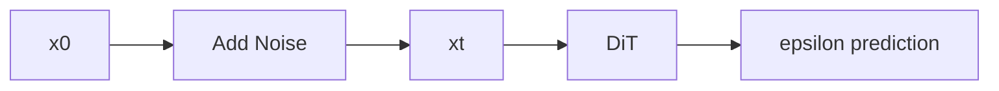
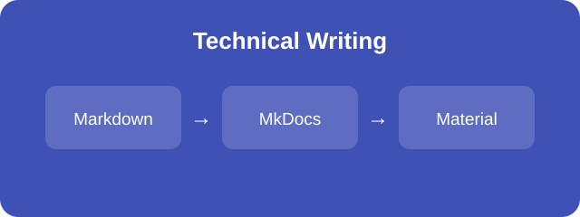

# Elements

这个页面用于集中验证技术写作所需的 Markdown 元素。右侧目录由本页标题自动生成。

## 文本与标题

这是一段普通段落，用来检查正文的字体、行高与段落间距。

### 三级标题

这里同时测试 **粗体**、*斜体*、~~删除线~~，以及行内代码 `python -m mkdocs serve`。

## 代码

Python 代码块：

```python
def add_noise(x_0, epsilon, alpha_bar_t):
    return alpha_bar_t**0.5 * x_0 + (1 - alpha_bar_t)**0.5 * epsilon
```

Bash 代码块：

```bash
source .venv/bin/activate
mkdocs serve
```

带行号的代码块：

```python linenums="1"
for step in range(3):
    loss = train_step(step)
    print(f"step={step}, loss={loss:.4f}")
```

## 表格

| 元素 | 用途 | 状态 |
| --- | --- | --- |
| Highlight | 代码高亮 | 已启用 |
| MathJax | LaTeX 公式 | 已启用 |
| Mermaid | 流程图 | 已启用 |

## 数学公式

行内公式：\( \epsilon \sim \mathcal{N}(0, I) \)。

块级公式：

\[
x_t = \sqrt{\bar{\alpha}_t}x_0
  + \sqrt{1-\bar{\alpha}_t}\epsilon
\]

多行 aligned 公式：

\[
\begin{aligned}
x_t &= \sqrt{\bar{\alpha}_t}x_0
  + \sqrt{1-\bar{\alpha}_t}\epsilon \\
\hat{x}_0 &=
  \frac{x_t-\sqrt{1-\bar{\alpha}_t}\epsilon_\theta}
       {\sqrt{\bar{\alpha}_t}}
\end{aligned}
\]

## Mermaid 流程图



## 图片与链接

普通图片：



使用 `attr_list` 控制宽度的图片：

{ width="320" }

这是一个指向 [Material for MkDocs 官方文档](https://squidfunk.github.io/mkdocs-material/) 的超链接，也可以访问站内的 [Notes 页面](../notes/index.md)。

## 引用与脚注

> 技术文档的示例应当可以直接运行，并且能够被持续验证。

扩散模型通常通过逐步加噪构造训练样本。[^diffusion]

[^diffusion]: 这是一个用于验证脚注渲染的简短说明。

## Admonition

!!! note "Note"
    这是一个普通说明块。

!!! warning "Warning"
    修改配置后应再次运行严格模式构建。

!!! tip "Tip"
    本地写作时可以使用实时预览检查效果。

## Details 折叠块

??? abstract "点击展开详情"
    这段内容默认折叠，用于验证 `pymdownx.details`。

## Tabbed Content

=== "Python"

    ```python
    print("Hello from Python")
    ```

=== "Bash"

    ```bash
    echo "Hello from Bash"
    ```

## 列表

无序列表：

- 配置扩展
- 编写内容
- 验证构建

有序列表：

1. 激活虚拟环境
2. 启动本地服务
3. 打开测试页面